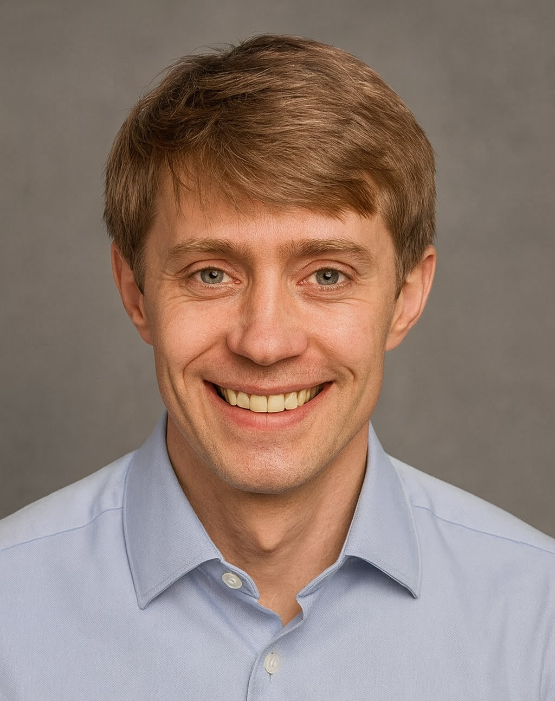

:::::: columns
:::: {.column width="70%"}
::: {style="font-size: 1.5rem;"}

I am an Associate Professor at DTU Bioengineering working at the intersection of fungal biotechnology, data science, and laboratory automation. My research focuses on turning fungal biodiversity into useful biosolutions by combining high-throughput experimentation, structured data capture, predictive modelling, and AI-assisted workflows.

A central part of this work is building digital infrastructure for bioengineering. I developed Teemi, an open-source tool for planning, executing, and learning from Design-Build-Test-Learn workflows, and I now use these ideas in projects such as IBIS and RAPIDFUNG to connect fungal strain collections, robotic experimentation, and modelling.

This website gathers my CV and a few examples of digital tools I have developed.

:::
::::

::: {.column width="30%"}
{style="border-radius: 10px; max-width: 100%;"}
:::
::::::
